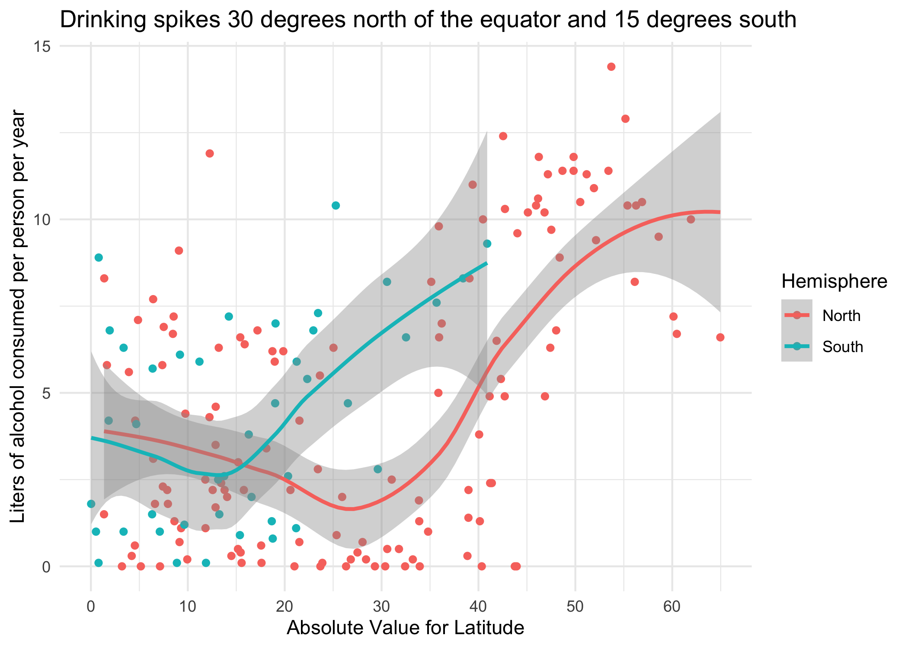
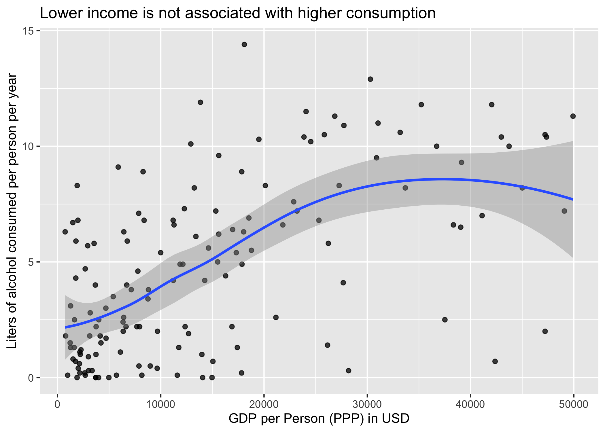

Alcohol consumption as function of latitude and wealth
================
JP
July 7, 2017

# Overview

This script explores global norms of alcohol consumption. I performed
this analysis because I had no idea what alcohol consumption looked like
globally, and I wanted to
know.

<!-- -->

<!-- -->

<!-- -->

<!-- --><!-- -->

<!-- -->

TBD: Add in religion as a variable.

Wealthy countries in northernmost latitudes driving the plunge in
alcohol consumption:

<table class="table" style="margin-left: auto; margin-right: auto;">

<thead>

<tr>

<th style="text-align:left;">

country

</th>

<th style="text-align:right;">

total

</th>

<th style="text-align:right;">

latitude

</th>

<th style="text-align:left;">

GDP PPP

</th>

</tr>

</thead>

<tbody>

<tr>

<td style="text-align:left;">

Iceland

</td>

<td style="text-align:right;">

6.6

</td>

<td style="text-align:right;">

65

</td>

<td style="text-align:left;">

$53,000

</td>

</tr>

<tr>

<td style="text-align:left;">

Norway

</td>

<td style="text-align:right;">

6.7

</td>

<td style="text-align:right;">

60

</td>

<td style="text-align:left;">

$58,000

</td>

</tr>

<tr>

<td style="text-align:left;">

Sweden

</td>

<td style="text-align:right;">

7.2

</td>

<td style="text-align:right;">

60

</td>

<td style="text-align:left;">

$49,000

</td>

</tr>

<tr>

<td style="text-align:left;">

Canada

</td>

<td style="text-align:right;">

8.2

</td>

<td style="text-align:right;">

56

</td>

<td style="text-align:left;">

$45,000

</td>

</tr>

<tr>

<td style="text-align:left;">

Netherlands

</td>

<td style="text-align:right;">

9.4

</td>

<td style="text-align:right;">

52

</td>

<td style="text-align:left;">

$51,000

</td>

</tr>

<tr>

<td style="text-align:left;">

Estonia

</td>

<td style="text-align:right;">

9.5

</td>

<td style="text-align:right;">

59

</td>

<td style="text-align:left;">

$31,000

</td>

</tr>

<tr>

<td style="text-align:left;">

Finland

</td>

<td style="text-align:right;">

10.0

</td>

<td style="text-align:right;">

62

</td>

<td style="text-align:left;">

$44,000

</td>

</tr>

<tr>

<td style="text-align:left;">

Denmark

</td>

<td style="text-align:right;">

10.4

</td>

<td style="text-align:right;">

56

</td>

<td style="text-align:left;">

$51,000

</td>

</tr>

<tr>

<td style="text-align:left;">

United Kingdom

</td>

<td style="text-align:right;">

10.4

</td>

<td style="text-align:right;">

55

</td>

<td style="text-align:left;">

$43,000

</td>

</tr>

<tr>

<td style="text-align:left;">

Belgium

</td>

<td style="text-align:right;">

10.5

</td>

<td style="text-align:right;">

51

</td>

<td style="text-align:left;">

$47,000

</td>

</tr>

<tr>

<td style="text-align:left;">

Germany

</td>

<td style="text-align:right;">

11.3

</td>

<td style="text-align:right;">

51

</td>

<td style="text-align:left;">

$50,000

</td>

</tr>

<tr>

<td style="text-align:left;">

Ireland

</td>

<td style="text-align:right;">

11.4

</td>

<td style="text-align:right;">

53

</td>

<td style="text-align:left;">

$71,000

</td>

</tr>

<tr>

<td style="text-align:left;">

Lithuania

</td>

<td style="text-align:right;">

12.9

</td>

<td style="text-align:right;">

55

</td>

<td style="text-align:left;">

$30,000

</td>

</tr>

</tbody>

</table>
