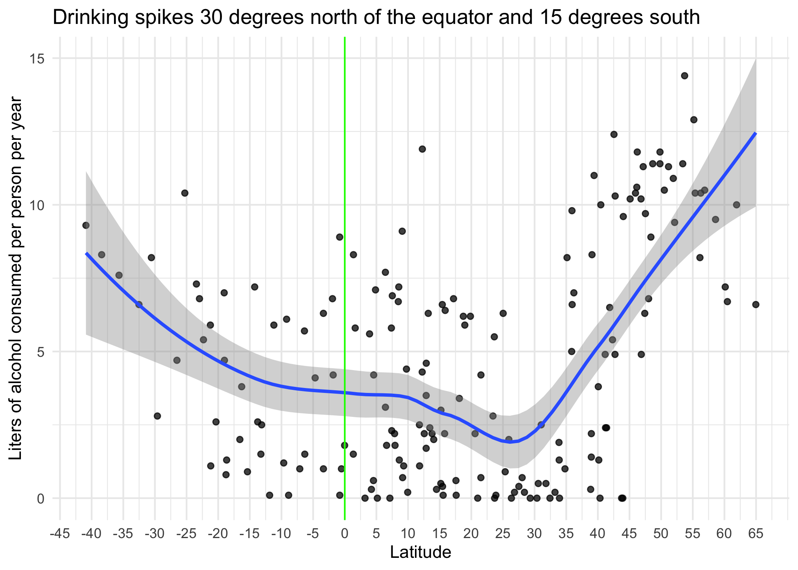
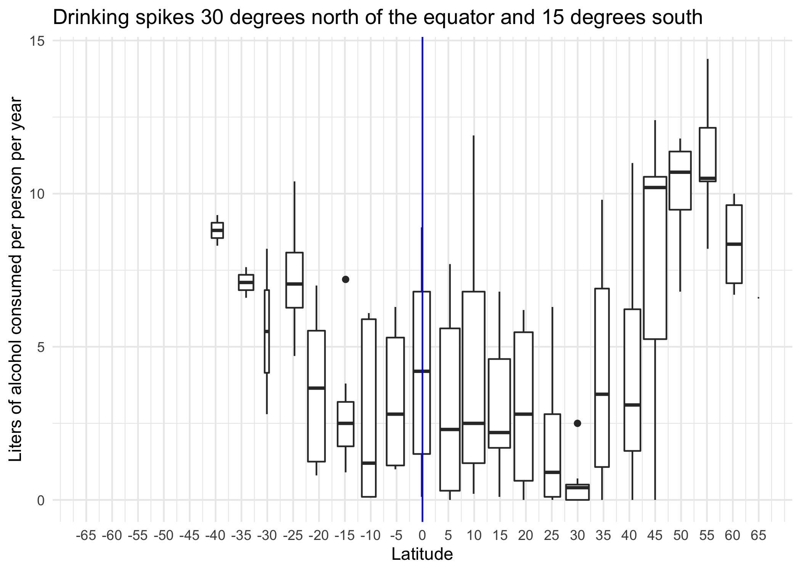
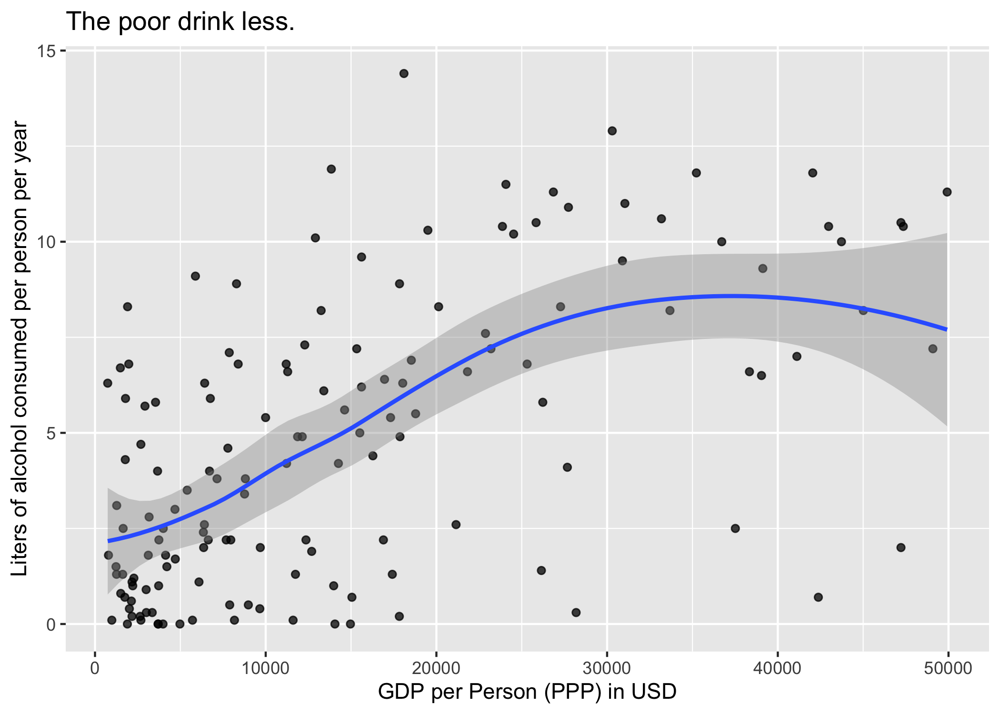

Alcohol consumption as function of latitude and wealth
================
JP
July 7, 2017

# Overview

This script explores global norms of alcohol consumption. I performed
this analysis because I had no idea what alcohol consumption looked like
globally, and I wanted to know.

``` r
library(breadcrumbs)
library(kableExtra)
library(knitr)
library(tidyverse)
library(readr)
library(stringr)
library(forcats)
source_file_paths()
```

Poking around:

``` r
drinks %>% arrange(desc(total))
```

    ## # A tibble: 193 x 10
    ##    country beer_servings spirit_servings wine_servings total abbr_2
    ##    <chr>           <dbl>           <dbl>         <dbl> <dbl> <chr> 
    ##  1 Belarus           142             373            42  14.4 BY    
    ##  2 Lithua…           343             244            56  12.9 LT    
    ##  3 Andorra           245             138           312  12.4 AD    
    ##  4 Grenada           199             438            28  11.9 GD    
    ##  5 Czech …           361             170           134  11.8 CZ    
    ##  6 France            127             151           370  11.8 FR    
    ##  7 Russia…           247             326            73  11.5 <NA>  
    ##  8 Ireland           313             118           165  11.4 IE    
    ##  9 Luxemb…           236             133           271  11.4 LU    
    ## 10 Slovak…           196             293           116  11.4 SK    
    ## # … with 183 more rows, and 4 more variables: latitude <dbl>,
    ## #   longitude <dbl>, abbr <chr>, ppp <dbl>

``` r
drinks %>% filter(str_detect(country, "R")) %>% arrange(desc(country))
```

    ## # A tibble: 8 x 10
    ##   country beer_servings spirit_servings wine_servings total abbr_2 latitude
    ##   <chr>           <dbl>           <dbl>         <dbl> <dbl> <chr>     <dbl>
    ## 1 Rwanda             43               2             0   6.8 RW        -1.94
    ## 2 Russia…           247             326            73  11.5 <NA>      NA   
    ## 3 Romania           297             122           167  10.4 RO        45.9 
    ## 4 DR Con…            32               3             1   2.3 <NA>      NA   
    ## 5 Domini…           193             147             9   6.2 DO        18.7 
    ## 6 Czech …           361             170           134  11.8 CZ        49.8 
    ## 7 Costa …           149              87            11   4.4 CR         9.75
    ## 8 Centra…            17               2             1   1.8 CF         6.61
    ## # … with 3 more variables: longitude <dbl>, abbr <chr>, ppp <dbl>

``` r
drinks %>% filter(country == "Russian Federation")
```

    ## # A tibble: 1 x 10
    ##   country beer_servings spirit_servings wine_servings total abbr_2 latitude
    ##   <chr>           <dbl>           <dbl>         <dbl> <dbl> <chr>     <dbl>
    ## 1 Russia…           247             326            73  11.5 <NA>         NA
    ## # … with 3 more variables: longitude <dbl>, abbr <chr>, ppp <dbl>

``` r
drinks %>% 
  mutate(
    lat_abs = abs(latitude),
    ns = ifelse(latitude > 0, "North",
      ifelse(latitude <= 0, "South", NA))
  ) %>% 
  filter(complete.cases(ns)) %>% 
  ggplot(aes(x = lat_abs, y = total, color = ns)) + 
  geom_point() + 
  geom_smooth() + 
  scale_color_discrete("Hemisphere") + 
  scale_x_continuous(breaks = seq(0, 80, by = 10)) + 
  labs(
    title = "Drinking spikes when you are farther than 30-degrees north from the equator,\nespecially so in the northern hemisphere.",
    x = "Absolute Value for Latitude",
    y = "Liters of alcohol consumed per person per year"
  )
```

<!-- -->

``` r
drinks %>% 
  ggplot(aes(x = latitude, y = total)) + 
  geom_point(alpha = .75) + 
  geom_smooth() + 
  geom_vline(xintercept = 0, color = "green") + 
  scale_color_discrete("Hemisphere") + 
  scale_x_continuous(breaks = seq(-45, 65, by = 5)) + 
  labs(
    title = "Drinking spikes when you are farther than 30-degrees north from the equator,\nespecially so in the northern hemisphere.",
    x = "Latitude",
    y = "Liters of alcohol consumed per person per year"
  )
```

<!-- -->

``` r
drinks %>% 
  ggplot(aes(x = latitude, y = total)) + 
  geom_boxplot(aes(group = cut_width(latitude, 5))) + 
  scale_x_continuous(breaks = seq(-65, 65, by = 5), limits = c(-65, 65)) + 
  geom_vline(xintercept = 0, color = "blue") + 
  labs(
    title = "Drinking spikes when you are farther than 30-degrees north of the equator,\nor 15 degrees south",
    x = "Latitude",
    y = "Liters of alcohol consumed per person per year"
  )
```

<!-- -->

``` r
drinks %>% 
  ggplot(aes(x = ppp, y = total)) + 
  geom_point(alpha = .75) + 
  geom_smooth() 
```

<!-- -->

``` r
drinks %>% 
  filter(ppp < 5e4) %>% 
  ggplot(aes(x = ppp, y = total)) + 
  geom_point(alpha = .75) + 
  geom_smooth() + 
  labs(
    title = "The poor drink less.",
    x = "GDP per Person (PPP) in USD",
    y = "Liters of alcohol consumed per person per year"
  ) 
```

<!-- -->

``` r
drinks %>% 
  mutate(
    ppp_f = ifelse(ppp <= 15000, "low",
      ifelse(ppp > 15000 & ppp < 30000, "medium",
      ifelse(ppp >= 30000, "high", NA)
    )),
    ppp_f = factor(ppp_f, levels = c("low", "medium", "high"))
  ) %>% 
  filter(complete.cases(ppp_f)) %>% 
  ggplot(aes(x = latitude, y = total, color = fct_rev(ppp_f))) + 
  geom_point(alpha = .75) + 
  geom_smooth() + 
  geom_vline(xintercept = 0, color = "black") + 
  scale_color_discrete("PPP") + 
  scale_x_continuous(breaks = seq(-45, 65, by = 5)) + 
  labs(
    title = "Wealthy countries buck the trend of higher drinking in the far north.",
    x = "Latitude",
    y = "Liters of alcohol consumed per person per year"
  )
```

<!-- -->

TBD: Add in religion as a variable.

High PPP countries in northern latitudes driving the plunge in alcohol
consumption:

``` r
my_table <- 
  drinks %>% 
  mutate(
    ppp_f = ifelse(ppp <= 15000, "low",
      ifelse(ppp > 15000 & ppp < 30000, "medium",
      ifelse(ppp >= 30000, "high", NA)
    )),
    ppp_f = factor(ppp_f, levels = c("low", "medium", "high"))
  ) %>% 
  filter(
    complete.cases(ppp_f),
    ppp_f == "high",
    latitude > 50) %>% 
  select(country, total, latitude, ppp) %>% 
  arrange(-total) %>% 
  kable(format = "html") 

kable_styling(my_table)
```

<table class="table" style="margin-left: auto; margin-right: auto;">

<thead>

<tr>

<th style="text-align:left;">

country

</th>

<th style="text-align:right;">

total

</th>

<th style="text-align:right;">

latitude

</th>

<th style="text-align:right;">

ppp

</th>

</tr>

</thead>

<tbody>

<tr>

<td style="text-align:left;">

Lithuania

</td>

<td style="text-align:right;">

12.9

</td>

<td style="text-align:right;">

55.16944

</td>

<td style="text-align:right;">

30299.92

</td>

</tr>

<tr>

<td style="text-align:left;">

Ireland

</td>

<td style="text-align:right;">

11.4

</td>

<td style="text-align:right;">

53.41291

</td>

<td style="text-align:right;">

70522.23

</td>

</tr>

<tr>

<td style="text-align:left;">

Germany

</td>

<td style="text-align:right;">

11.3

</td>

<td style="text-align:right;">

51.16569

</td>

<td style="text-align:right;">

49921.33

</td>

</tr>

<tr>

<td style="text-align:left;">

Belgium

</td>

<td style="text-align:right;">

10.5

</td>

<td style="text-align:right;">

50.50389

</td>

<td style="text-align:right;">

47214.18

</td>

</tr>

<tr>

<td style="text-align:left;">

Denmark

</td>

<td style="text-align:right;">

10.4

</td>

<td style="text-align:right;">

56.26392

</td>

<td style="text-align:right;">

50694.19

</td>

</tr>

<tr>

<td style="text-align:left;">

United Kingdom

</td>

<td style="text-align:right;">

10.4

</td>

<td style="text-align:right;">

55.37805

</td>

<td style="text-align:right;">

42977.22

</td>

</tr>

<tr>

<td style="text-align:left;">

Finland

</td>

<td style="text-align:right;">

10.0

</td>

<td style="text-align:right;">

61.92411

</td>

<td style="text-align:right;">

43729.96

</td>

</tr>

<tr>

<td style="text-align:left;">

Estonia

</td>

<td style="text-align:right;">

9.5

</td>

<td style="text-align:right;">

58.59527

</td>

<td style="text-align:right;">

30897.55

</td>

</tr>

<tr>

<td style="text-align:left;">

Netherlands

</td>

<td style="text-align:right;">

9.4

</td>

<td style="text-align:right;">

52.13263

</td>

<td style="text-align:right;">

51338.57

</td>

</tr>

<tr>

<td style="text-align:left;">

Canada

</td>

<td style="text-align:right;">

8.2

</td>

<td style="text-align:right;">

56.13037

</td>

<td style="text-align:right;">

45011.64

</td>

</tr>

<tr>

<td style="text-align:left;">

Sweden

</td>

<td style="text-align:right;">

7.2

</td>

<td style="text-align:right;">

60.12816

</td>

<td style="text-align:right;">

49084.07

</td>

</tr>

<tr>

<td style="text-align:left;">

Norway

</td>

<td style="text-align:right;">

6.7

</td>

<td style="text-align:right;">

60.47202

</td>

<td style="text-align:right;">

58138.44

</td>

</tr>

<tr>

<td style="text-align:left;">

Iceland

</td>

<td style="text-align:right;">

6.6

</td>

<td style="text-align:right;">

64.96305

</td>

<td style="text-align:right;">

52582.29

</td>

</tr>

</tbody>

</table>
