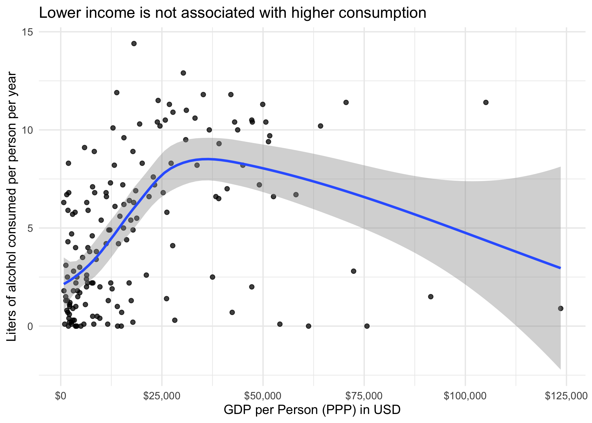

Alcohol consumption as function of latitude and wealth
================
JP
July 7, 2017

# Overview

This script explores global norms of alcohol consumption. I performed
this analysis because I had no idea what alcohol consumption looked like
globally, and I wanted to
know.

<!-- -->

<!-- -->

<!-- -->

<!-- --><!-- -->

<!-- -->

TBD: Add in religion as a variable.

Wealthy countries in northernmost latitudes driving the plunge in
alcohol consumption:

<table class="table" style="margin-left: auto; margin-right: auto;">

<thead>

<tr>

<th style="text-align:left;">

country

</th>

<th style="text-align:right;">

total

</th>

<th style="text-align:right;">

latitude

</th>

<th style="text-align:right;">

ppp

</th>

</tr>

</thead>

<tbody>

<tr>

<td style="text-align:left;">

Lithuania

</td>

<td style="text-align:right;">

12.9

</td>

<td style="text-align:right;">

55.16944

</td>

<td style="text-align:right;">

30299.92

</td>

</tr>

<tr>

<td style="text-align:left;">

Ireland

</td>

<td style="text-align:right;">

11.4

</td>

<td style="text-align:right;">

53.41291

</td>

<td style="text-align:right;">

70522.23

</td>

</tr>

<tr>

<td style="text-align:left;">

Germany

</td>

<td style="text-align:right;">

11.3

</td>

<td style="text-align:right;">

51.16569

</td>

<td style="text-align:right;">

49921.33

</td>

</tr>

<tr>

<td style="text-align:left;">

Belgium

</td>

<td style="text-align:right;">

10.5

</td>

<td style="text-align:right;">

50.50389

</td>

<td style="text-align:right;">

47214.18

</td>

</tr>

<tr>

<td style="text-align:left;">

Denmark

</td>

<td style="text-align:right;">

10.4

</td>

<td style="text-align:right;">

56.26392

</td>

<td style="text-align:right;">

50694.19

</td>

</tr>

<tr>

<td style="text-align:left;">

United Kingdom

</td>

<td style="text-align:right;">

10.4

</td>

<td style="text-align:right;">

55.37805

</td>

<td style="text-align:right;">

42977.22

</td>

</tr>

<tr>

<td style="text-align:left;">

Finland

</td>

<td style="text-align:right;">

10.0

</td>

<td style="text-align:right;">

61.92411

</td>

<td style="text-align:right;">

43729.96

</td>

</tr>

<tr>

<td style="text-align:left;">

Estonia

</td>

<td style="text-align:right;">

9.5

</td>

<td style="text-align:right;">

58.59527

</td>

<td style="text-align:right;">

30897.55

</td>

</tr>

<tr>

<td style="text-align:left;">

Netherlands

</td>

<td style="text-align:right;">

9.4

</td>

<td style="text-align:right;">

52.13263

</td>

<td style="text-align:right;">

51338.57

</td>

</tr>

<tr>

<td style="text-align:left;">

Canada

</td>

<td style="text-align:right;">

8.2

</td>

<td style="text-align:right;">

56.13037

</td>

<td style="text-align:right;">

45011.64

</td>

</tr>

<tr>

<td style="text-align:left;">

Sweden

</td>

<td style="text-align:right;">

7.2

</td>

<td style="text-align:right;">

60.12816

</td>

<td style="text-align:right;">

49084.07

</td>

</tr>

<tr>

<td style="text-align:left;">

Norway

</td>

<td style="text-align:right;">

6.7

</td>

<td style="text-align:right;">

60.47202

</td>

<td style="text-align:right;">

58138.44

</td>

</tr>

<tr>

<td style="text-align:left;">

Iceland

</td>

<td style="text-align:right;">

6.6

</td>

<td style="text-align:right;">

64.96305

</td>

<td style="text-align:right;">

52582.29

</td>

</tr>

</tbody>

</table>
